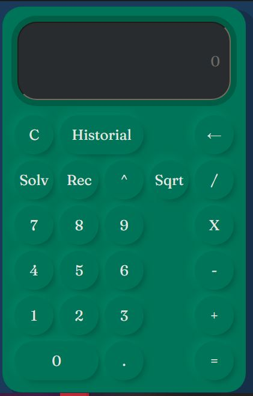

# Frontend
## Descripción
En este feature se entrega el frontend desarrollado en Angular el cuál servira para el funcionamiento de una calculadora.
## Funcionalidad
Calculadora la cuál esta compuesta por una caja de texto, botones con números y funciones que pueden ser usadas por el usuario como lo son:
Suma, resta, multiplicación, división, potencia, etc...

